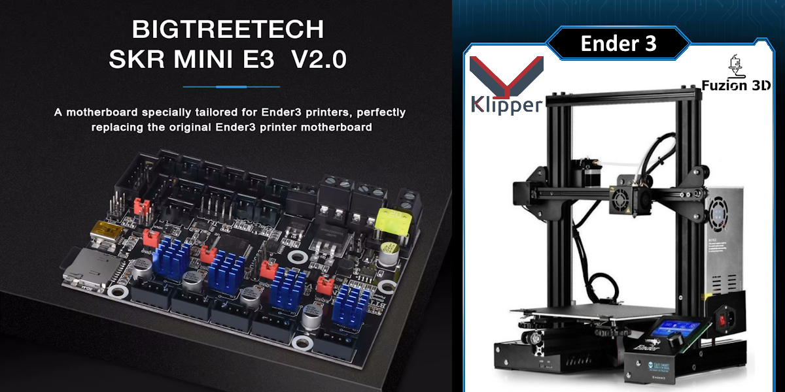

<h1 align="center">🚀 Klipper para Ender 3 + SKR E3 V2 🎯</h1>

  

<h2>📦 ¿Qué hay aquí?</h2>
<ul>
  <li>✅ <b>Firmware ya compilado</b>: Solo flashea y a imprimir.</li>
  <li>✅ <b>Configuración lista para usar</b>: Un <code>printer.cfg</code> optimizado para esta placa.</li>
  <li>✅ <b>Guía rápida</b> para que no te pierdas en el proceso.</li>
</ul>

<h2>🚀 Instalación Express</h2>
<ol>
  <li>Instalar Klipper, Moonraker y la interfaz web (Mainsail/Fluidd). 
  <a href="https://github.com/dw-0/kiauh" style="text-decoration: none; color: inherit;">[Guía de instalación]</a>
</li>

  <li>Flashea el firmware en la SKR E3 V2 (te dejo el <code>firmware.bin</code> listo).</li>
  <li>Copia el <code>printer.cfg</code> en tu Raspberry Pi u host Klipper.</li>
  <li>Reinicia y ajusta lo necesario.</li>
  <li>¡A imprimir con la velocidad de un cohete! 🚀</li>
</ol>

<h2>🔧 Proceso para flashear el firmware</h2>
<ol>
  <li>Formatea una tarjeta microSD en <b>FAT32</b>.</li>
  <li>Copia el archivo <code>firmware.bin</code> a la raíz de la microSD.</li>
  <li>Inserta la microSD en la SKR E3 V2 y apaga la impresora.</li>
  <li>Enciende la impresora y espera unos segundos.</li>
  <li>El firmware se flasheará automáticamente. La tarjeta SD ahora tendrá un archivo con un nombre diferente (esto indica que el proceso fue exitoso).</li>
  <li>Retira la microSD y ya puedes conectar la impresora a Klipper.</li>
</ol>

<h2>⚙️ Requisitos</h2>
<ul>
  <li>🔹 Raspberry Pi con <b>Klipper instalado</b>.</li>
  <li>🔹 Conexión UART entre la placa y la Pi.</li>
  <li>🔹 ¡Ganas de imprimir más rápido y mejor! 😎</li>
</ul>

<h2>🎯 ¿Por qué Klipper?</h2>
<ul>
  <li>🔥 <b>Mayor velocidad sin perder calidad.</b></li>
  <li>🔧 <b>Mejor control de aceleración.</b></li>
  <li>📈 <b>Optimización de cálculos en la Pi, no en la placa.</b></li>
</ul>

---

## 🌐 Conéctate con Fuzion3D
¡Síguenos en redes sociales para más contenido sobre impresión 3D, tutoriales y novedades!

🔹 **TikTok:** [@fuzion3d](https://www.tiktok.com/@fuzion3d) 🎥
🔹 **Instagram:** [@fuzion3dcrea](https://www.instagram.com/fuzion3dcrea) 📸
🔹 **YouTube:** [@fuzion3dcrea](https://youtube.com/@fuzion3dcrea) 🎬

¡Únete a la comunidad y comparte tus creaciones con nosotros! 🚀🔥

## 📜 Licencia y Créditos
Este proyecto es de código abierto bajo la licencia **MIT**. ¡Modifícalo, mejóralo y compártelo!

🛠️ **Creado con amor por la comunidad maker por Fuzion 3D!!.** 💙

---

<h2 align="center">🌐 Fuentes y más información </h2>

<table align="center">
<tr>
    <th><h3><a href="https://github.com/Klipper3d/klipper">Klipper</a></h3></th>
    <th><h3><a href="https://github.com/Arksine/moonraker">Moonraker</a></h3></th>
    <th><h3><a href="https://github.com/mainsail-crew/mainsail">Mainsail</a></h3></th>
</tr>
<tr>
    <th></th>
    <th></th>
    <th></th>
</tr>
<tr>
    <th>by <a href="https://github.com/KevinOConnor">KevinOConnor</a></th>
    <th>by <a href="https://github.com/Arksine">Arksine</a></th>
    <th>by <a href="https://github.com/mainsail-crew">mainsail-crew</a></th>
</tr>

<tr>
    <th><h3><a href="https://github.com/fluidd-core/fluidd">Fluidd</a></h3></th>
    <th><h3><a href="https://github.com/jordanruthe/KlipperScreen">KlipperScreen</a></h3></th>
    <th><h3><a href="https://github.com/OctoPrint/OctoPrint">OctoPrint</a></h3></th>
</tr>
<tr>
    <th></th>
    <th></th>
    <th></th>
</tr>
<tr>
    <th>by <a href="https://github.com/fluidd-core">fluidd-core</a></th>
    <th>by <a href="https://github.com/jordanruthe">jordanruthe</a></th>
    <th>by <a href="https://github.com/OctoPrint">OctoPrint</a></th>
</tr>

<tr>
    <th><h3><a href="https://github.com/nlef/moonraker-telegram-bot">Moonraker-Telegram-Bot</a></h3></th>
    <th><h3><a href="https://github.com/Kragrathea/pgcode">PrettyGCode for Klipper</a></h3></th>
    <th><h3><a href="https://github.com/TheSpaghettiDetective/moonraker-obico">Obico for Klipper</a></h3></th>
</tr>
<tr>
    <th></th>
    <th></th>
    <th></th>
</tr>
<tr>
    <th>by <a href="https://github.com/nlef">nlef</a></th>
    <th>by <a href="https://github.com/Kragrathea">Kragrathea</a></th>
    <th>by <a href="https://github.com/TheSpaghettiDetective">Obico</a></th>
</tr>

<tr>
    <th><h3><a href="https://github.com/Clon1998/mobileraker_companion">Mobileraker's Companion</a></h3></th>
    <th><h3><a href="https://octoeverywhere.com/?source=kiauh_readme">OctoEverywhere For Klipper</a></h3></th>
    <th><h3><a href="https://github.com/crysxd/OctoApp-Plugin">OctoApp For Klipper</a></h3></th>
</tr>
<tr>
    <th></th>
    <th></th>
    <th></th>
</tr>
<tr>
    <th>by <a href="https://github.com/Clon1998">Patrick Schmidt</a></th>
    <th>by <a href="https://github.com/QuinnDamerell">Quinn Damerell</a></th>
    <th>by <a href="https://github.com/crysxd">Christian Würthner</a></th>
</tr>

<tr>
    <th><h3><a href="https://github.com/staubgeborener/klipper-backup">Klipper-Backup</a></h3></th>
    <th><h3><a href="https://simplyprint.io/">SimplyPrint for Klipper</a></h3></th>
</tr>
<tr>
    <th></th>
    <th></th>
</tr>
<tr>
    <th>by <a href="https://github.com/Staubgeborener">Staubgeborener</a></th>
    <th>by <a href="https://github.com/SimplyPrint">SimplyPrint</a></th>
</tr>
</table>

---

